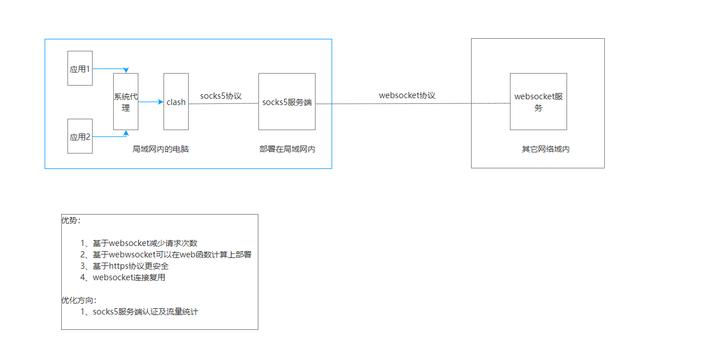
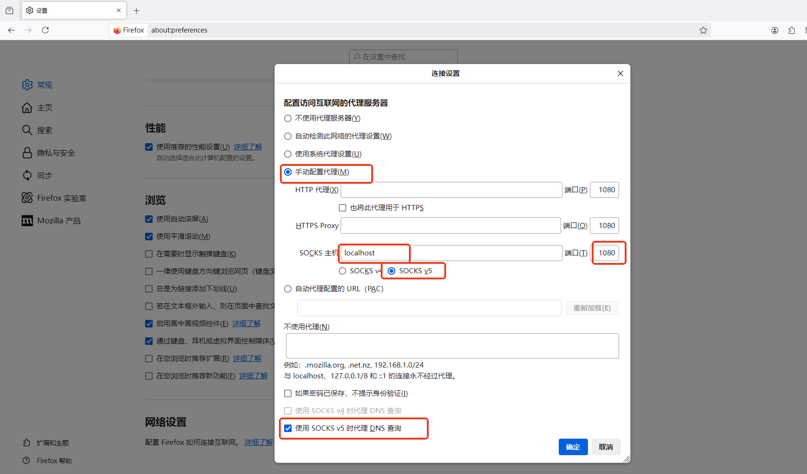

### webSocks5
- 目标:通过http端口访问局域网的其它服务
  - 
- 服务部署
  - 服务端
    - 项目打包 go mod download & go build,得到二进制包webSocks5
    - 阿里云注册账号
    - 函数计算部署
      - 打开链接 https://fcnext.console.aliyun.com/us-west-1/functions
      - 确认地域
      - 创建web类型函数
      - 填写参数
        - 函数名称: 随意
        - 运行时 debian9,通过文件夹上传二进制包(webSocks5)
        - 启动命令 ./.webSocks5 -m=s
        - 监听端口 1323
      - 高级配置
        - cpu 0.05
        - 内存 128mb
        - 执行超时 86400
        - 单实例并发度 200
      - 点击创建
        - 创建后
          - 配额管理，并发实例数上限，设置为1
          - 配置，触发器获取公网访问地址（不用时关闭，防止被盗用，也可以添加jwt token校验），比如https://one-xxx.ap-northeast-1.fcapp.run
  - 客户端
    - 启动 webSocks5 -m=c -ws=wss://one-xxx.ap-northeast-1.fcapp.run/ws
    - 如果添加了jwt，需要添加参数指定私钥文件，例如-cjp="C:\Users\86176\go\src\kexueOneGo\privateKey.txt"
- 访问
  - firefox
    - 配置
  - clash
    - 导入订阅
      - 触发器获取公网访问地址/clash.yaml
    - 打开系统代理
